<!-- ░▒▓ pinsql // profile.exe ▓▒░ -->

<div align="center">



<a href="https://github.com/pinsql">
  
</a>

<br/>


</div>

---

## `> cat /etc/pink.conf`

```yaml
handle:     pink            # aka pinsql
role:       pentester // red team enthusiast
mindset:    "if it has an input, it has a bug"
focus:
  - web application security   # XSS, SQLi, SSRF, IDOR, auth bypass
  - network & infra pentesting # recon -> foothold -> privesc -> pivot
  - CTFs & wargames            # HTB / THM / picoCTF grind
  - tooling & automation       # write the script before doing it twice
currently:  sharpening the blade
motto:      "hack the planet 🌐"
```

## `> ls ~/arsenal`

<div align="center">

**langs**<br/>


**platforms**<br/>


**tooling**<br/>


</div>

## `> ./killchain.sh --explain`

```text
 [ RECON ] ──► [ ENUM ] ──► [ EXPLOIT ] ──► [ PRIVESC ] ──► [ PIVOT ] ──► [ REPORT ]
     │            │             │               │              │             │
  osint,       ports,        foothold,       root/SYSTEM,   lateral,     the part that
  subdomains   dirs, vers    creativity      misconfigs     AD paths     actually pays
```

## `> cat ~/.stats`

<div align="center">


</div>

## `> ls -la ~/ops`

<div align="center">

<a href="https://github.com/pinsql/citadel"></a>
<a href="https://github.com/pinsql/pinsql"></a>

<a href="https://github.com/pinsql/simple-python-network-scanner"></a>
<a href="https://github.com/pinsql/mac_address_scanner"></a>

<a href="https://github.com/pinsql/AI-Sentiment-Analyzer"></a>
<a href="https://github.com/pinsql/steveweb_protfolio"></a>

</div>

```text
drwxr-x---  citadel                         // hardened base of operations
-rwxr-xr-x  simple-python-network-scanner   // sweep the subnet, list what's alive
-rwxr-xr-x  mac_address_scanner             // who's on the wire? vendor lookups by MAC
drwxr-xr-x  pinsql                          // network & security d3v op.
-rw-r--r--  AI-Sentiment-Analyzer           // NLP side quest (fork)
-rw-r--r--  steveweb_protfolio              // web front, hand-rolled HTML
```

## `> tail -f /var/log/contributions`

<div align="center">

<picture>
  <source media="(prefers-color-scheme: dark)" srcset="https://raw.githubusercontent.com/pinsql/pinsql/output/snake-dark.svg"/>
  <source media="(prefers-color-scheme: light)" srcset="https://raw.githubusercontent.com/pinsql/pinsql/output/snake-light.svg"/>
  
</picture>

<sub><code>[*] payload consumed every green square. no survivors.</code></sub>

</div>

## `> ping pink`

<div align="center">

<a href="https://x.com/wildkenyan"></a>
<a href="https://github.com/pinsql"></a>
<a href="https://x.com/wildkenyan"></a>

</div>

---

<div align="center">

```diff
+ all testing performed on systems i own or am explicitly authorized to test.
- no scope, no shells. that's the rule.
```


<sub>░▒▓ probably smug · a little nyef nyef · <code>EOF</code> ▓▒░</sub>

</div>
